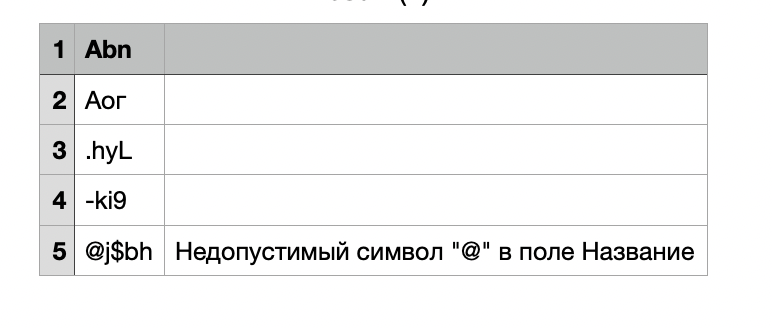

## Описание

- Скрипт простой поэтому все в одном файле.
- Скрипт проверяет, что файл успешно загружен.
- Открывает транзакцию в БД и построчно вгружает файл, валидируя строки.
- Параллельно формируется временный файл на отдачу пользователю.
- Если произошла ошибка, транзакция сделает rollback.
- Если все ок, стримим результирующий файл пользователю.

# Запуск окружения
Запуск через Docker, db.sql автоматически выполняется при старте контейнера.

```shell
doker compose up -d
```
Тест-страница http://127.0.0.1:8085


